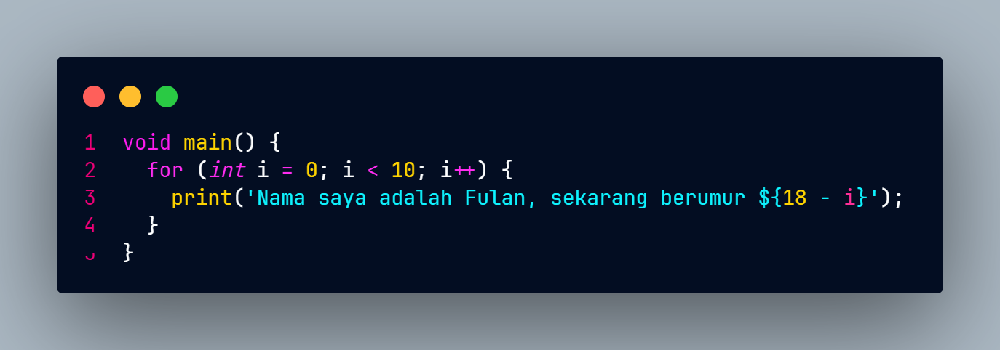
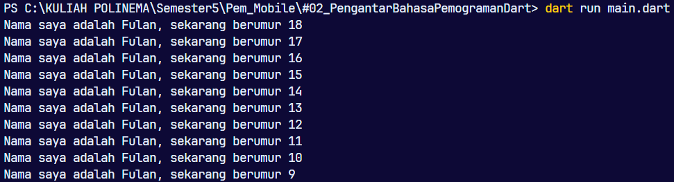

# Pemrograman Mobile - Pertemuan 1

## Project Hello World
## NO : 20
## NIM : 2241720226
## NAMA : Raffi Ilham Maulana

## **Soal 1**
Modifikasilah kode pada baris 3 di VS Code atau Editor Code favorit Anda berikut ini agar mendapatkan keluaran (output) sesuai yang diminta!

Output yang diminta:

### **Jawab** :

Code :

Output :

## **Soal 2**
Mengapa sangat penting untuk memahami bahasa pemrograman Dart sebelum kita menggunakan framework Flutter ? Jelaskan!   
 
jawab :  
Bahasa Dart adalah inti dari framework Flutter. Kerangka kerja modern seperti Flutter membutuhkan bahasa modern tingkat tinggi agar bisa memberikan pengalaman terbaik kepada pengembang, serta memungkinkan untuk membuat aplikasi seluler yang luar biasa. Memahami Dart adalah dasar untuk bekerja dengan Flutter; pengembang perlu mengetahui asal-usul bahasa Dart, bagaimana komunitas mengerjakannya, kelebihannya, dan mengapa itu adalah bahasa pemrograman yang dipilih untuk Flutter.

## **Soal 3**
Rangkumlah materi dari codelab ini menjadi poin-poin penting yang dapat Anda gunakan untuk membantu proses pengembangan aplikasi mobile menggunakan framework Flutter.
  
 
jawab :  
Dart adalah bahasa pemrograman yang dirancang untuk menggabungkan keunggulan bahasa tingkat tinggi dengan fitur-fitur modern, seperti alat produktivitas (alat analisis kode dan plugin IDE), pengelolaan memori otomatis (garbage collection), dan anotasi tipe opsional yang meningkatkan keamanan dan konsistensi data. Dart mendukung pengetikan statis dengan keamanan tipe (type-safe) dan inferensi tipe (type inference) untuk menemukan bug saat kompilasi. Selain itu, Dart bersifat portabel karena dapat dikompilasi menjadi JavaScript untuk aplikasi web atau kode native ARM dan x86. Pemahaman yang baik tentang Dart sangat penting untuk pengembangan Flutter, karena seluruh kode aplikasi, plugin, dan pengelolaan dependensi dilakukan menggunakan Dart. Untuk memulai, Anda bisa menggunakan DartPad, alat online yang memudahkan belajar dan bereksperimen dengan fitur-fitur Dart. Menguasai Dart akan meningkatkan produktivitas dan kenyamanan dalam menggunakan Flutter, karena Flutter sangat dipengaruhi oleh desain bahasa ini.