# **Pemrograman Mobile - Pertemuan 2**
### Project Hello World
### NO : 20
### NIM : 2241720226
### NAMA : Raffi Ilham Maulana

## **Praktikum 1 : Penerapan Arus Pengendalian (“if/else”)**
Selesaikan langkah praktis berikut menggunakan DartPad di browser Anda.

### Langkah 1:
Ketik atau salin kode program berikut ke dalam fungsi main().
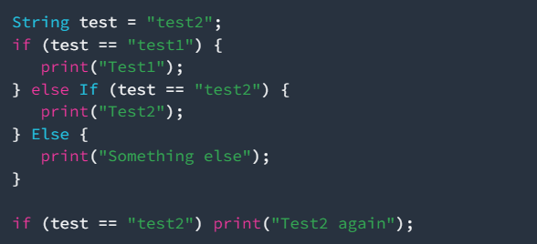
### Langkah 2:
Silakan coba jalankan (Run) kode pada langkah 1. Apa yang telah terjadi? Menjelaskan!
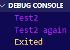  
jawab :  

### Langkah 3:
Tambahkan kode program berikut, lalu coba jalankan (Jalankan) kode Anda. 
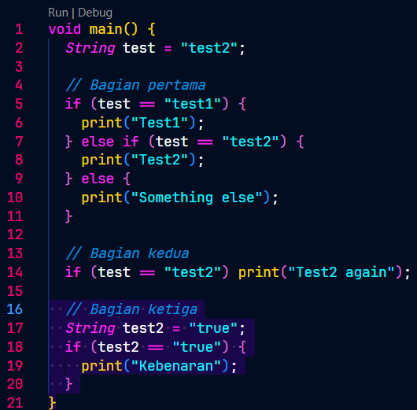

Apa yang telah terjadi? Jika terjadi error silahkan diperbaiki namun tetap menggunakan if/else.
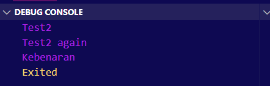

## **Praktikum 2 : Menerapkan Perulangan “ While” dan “Do-While”.**
Selesaikan langkah praktis berikut menggunakan DartPad di browser Anda.

### Langkah 1:
Ketik atau salin kode program berikut ke dalam fungsi main(). 
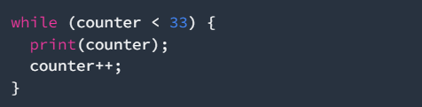

### Langkah 2:
Silakan coba jalankan (Run) kode pada langkah 1. Apa yang telah terjadi? Menjelaskan! Kemudian perbaiki jika terjadi kesalahan. 
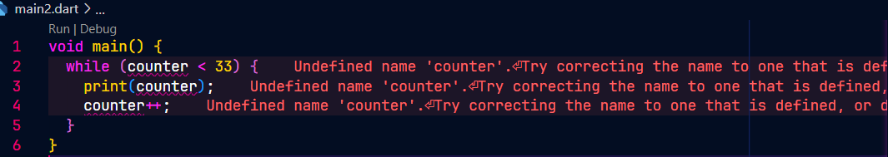 kode error
memperbaiki :
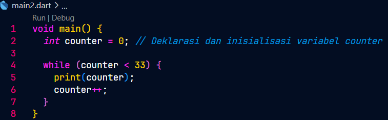
output :
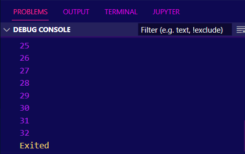

### Langkah 3:
Tambahkan kode program berikut, lalu coba jalankan (Jalankan) kode Anda.
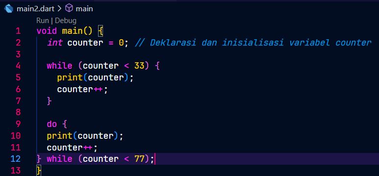
Apa yang telah terjadi? Jika terjadi error silahkan diperbaiki namun tetap menggunakan do- while.  
output :  
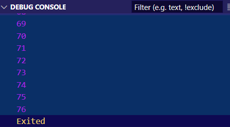

## **Praktikum 3 : Menerapkan Pengulangan “for” dan “break-continue”.**
Selesaikan langkah praktis berikut menggunakan DartPad di browser Anda.

### Langkah 1:
Ketik atau salin kode program berikut ke dalam fungsi main().
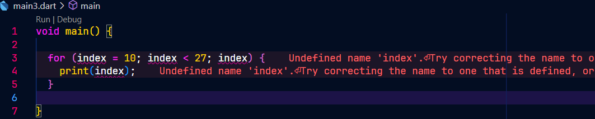
### Langkah 2:
Silakan coba jalankan (Run) kode pada langkah 1. Apa yang telah terjadi? Menjelaskan! Kemudian perbaiki jika terjadi kesalahan. 
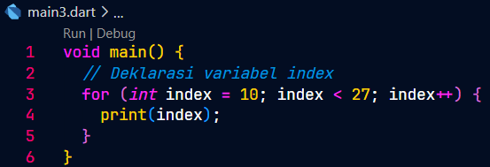  
output:
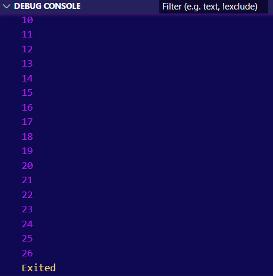
### Langkah 3:
Tambahkan kode program berikut pada for-loop , lalu coba jalankan (Run) kode Anda.
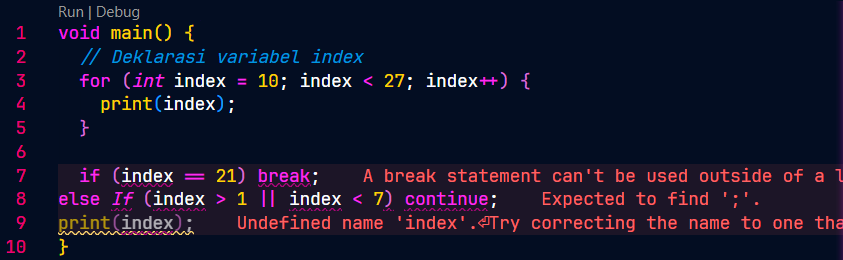
Apa yang telah terjadi? Jika terjadi error silahkan diperbaiki namun tetap menggunakan for dan break-continue .  

output
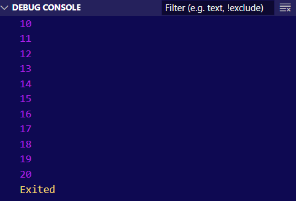

## **Tugas Praktek**
### 1.Silakan menyelesaikan Praktikum 1 s/d 3, kemudian dokumentasikan dalam bentuk screenshot hasil pengerjaan beserta penjelasannya!

### 2. Buatlah program yang dapat menampilkan bilangan prima dari 0 hingga 201 menggunakan Dart. Jika ditemukan bilangan prima, maka tampilkan nama lengkap dan NIM Anda.
Kode Program :  
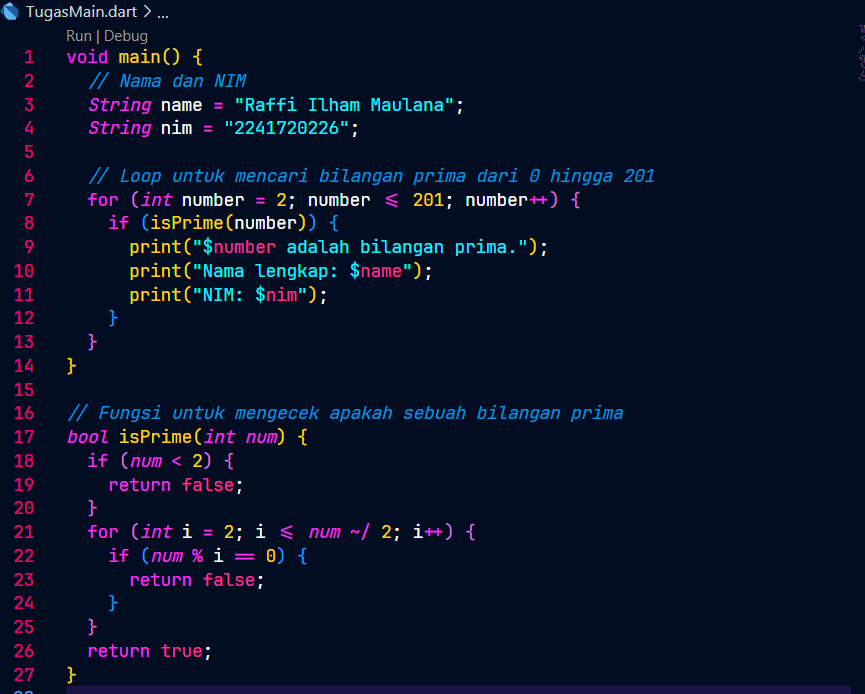
Output :  
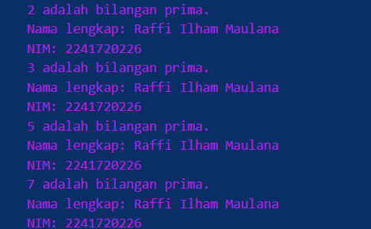
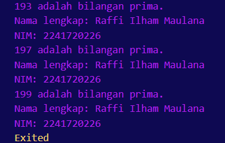

### 3. Kumpulkan dalam bentuk link commit repo GitHub pada link yang telah disediakan di grup Telegram!
