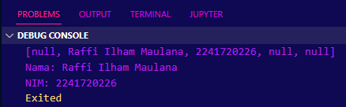
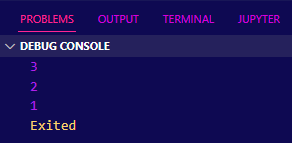
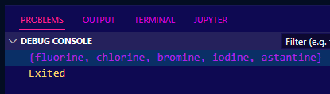
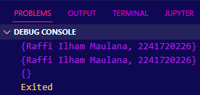

# **Pemrograman Mobile - Pertemuan 4**
### NO : 20
### NIM : 2241720226
### NAMA : Raffi Ilham Maulana


## Praktikum 1
### Langkah 1
```dart
var list = [1, 2, 3];
assert(list.length == 3);
assert(list[1] == 2);
print(list.length);
print(list[1]);

list[1] = 1;
assert(list[1] == 1);
print(list[1]);
```
### Langkah 2


- Keterangan = Menjelaskan tentang basic dari list, mulai dari memodifikasi elemen, cara mengakses elemen, dan penggunaan assertion.

### Langkah 3
#### Syntax
```dart
final List<String?> list = List.filled(5, null);
list[1] = 'Raffi Ilham Maulana';
list[2] = '2241720226';

assert(list.length == 5);
assert(list[1] == 'Raffi Ilham Maulana');
assert(list[2] == '2241720226');
print(list.length);
print(list[1]);
print(list[2]);
```
#### Hasil


- Keterangan = kode diatas mendeklarasi variabel final dengan maksimal index sebangak 5 dan variabel yang dideklarasi dapat menampung nilai string atau null dengan index ke 1 dan ke 2 dari list di isi dengan nama dan NIM masing-masing

## Praktikum 2
### Langkah 1
```dart
var halogens = {'fluorine', 'chlorine', 'bromine', 'iodine', 'astatine'};
print(halogens);
```
### Langkah 2


- Keterangan = kode diatas menjelaskan tentang penggunaan set mulai dari cara deklarasi set dan print cara print set

### Langkah 3
#### Syntax
```dart
var names1 = <String>{};
Set<String> names2 = {}; // This works, too.
var names3 = {}; // Creates a map, not a set.

names1.add('Raffi Ilham Maulana');
names1.add('2241720226');

names2.addAll({'Raffi Ilham Maulana', '2241720226'});

print(names1);
print(names2);
print(names3);
```
#### Hasil


- Keterangan = pada kode sebelumnya belum ditambahkan fungsi .add() dan .addAll() yang dimana .add() berguna untuk tambah satu persatu dimasukkan ke dalam set names1 sedangkan untuk .addAll() berguna untuk menambahkan nilai secara sekaligus ke dalam set names2

## Praktikum 3
### Langkah 1
```dart
var gifts = {
  // Key:    Value
  'first': 'partridge',
  'second': 'turtledoves',
  'fifth': 1
};

var nobleGases = {
  2: 'helium',
  10: 'neon',
  18: 2,
};

print(gifts);
print(nobleGases);
```
### Langkah 2


- Keterangan = disini deklarasi maps gifts dan nobleGases, dimana gifts dan nobleGases berisi 3 key dengan masing masing value

### Langkah 3
#### Syntax
```dart
var mhs1 = Map<String, String>();
gifts['first'] = 'partridge';
gifts['second'] = 'turtledoves';
gifts['fifth'] = 'golden rings';

var mhs2 = Map<int, String>();
nobleGases[2] = 'helium';
nobleGases[10] = 'neon';
nobleGases[18] = 'argon';

gifts['name'] = 'Raffi Ilham Maulana';
gifts['NIM'] = '2241720258';

nobleGases[1] = 'Raffi Ilham Maulana';
nobleGases[3] = '2241720258';

mhs1['name'] = 'Raffi Ilham Maulana';
mhs1['NIM'] = '2241720258';

mhs2[1] = 'Raffi Ilham Maulana';
mhs2[2] = '2241720258';

print(gifts);
print(nobleGases);
print(mhs1);
print(mhs2);
```
#### Hasil


- Keterangan = disini pada maps gifts dengan value fifth di edit ke golden rings dan maps nobleGases dengan value 18 di edit ke argon, disini juga maps gifts dan nobleGases ditambahkan value baru yaitu nama dan NIM, dan juga ada deklarasi maps baru yaitu mhs1 dan mhs2 dengan isi value nya adalah nama dan NIM 

## Praktikum 4
### Langkah 1
```dart
var list1 = [1, 2, 3];
var list2 = [0, ...list1];
print(list1);
print(list2);
print(list2.length);
```
### Langkah 2


- Keterangan = disini list dengan nama list2 menginclude semua elemen dari list1 ke list2, kemudian panjang dari list2 di print yang dimana ada sebanyak 4 karena menginclude dari list1 dan 1 index awal dari list2

### Langkah 3
#### Syntax
```dart
list1 = [1, 2, null];
print(list1);
var list3 = [0, ...?list1];
print(list3.length);
```
#### Hasil


- Keterangan = dari kode diatas terdapat error dimana elemen type null tidak bisa di sandingkan dengan elemen type int, perlu diubah terlebih dahulu menjadi seperti berikut `List<int?> list1 = [1, 2, 3];` baru list1 dapat di isikan nilai null

### Langkah 4
#### Syntax
```dart
bool promoActive = true;
var nav = ['Home', 'Furniture', 'Plants', if (promoActive) 'Outlet'];
print(nav);

promoActive = false;
nav = ['Home', 'Furniture', 'Plants', if (promoActive) 'Outlet'];
print(nav);
```
#### Hasil


- Keterangan = disini perlu mendeklarasi variabel promoActive yang dimana bertipe boolean true kemudian dipanggil di dalam list nav yang dimana jika promoActive dipanggil dan true maka outlet akan dimasukkan ke dalam list tapi jika dalam deklarasi nilai promoActive adalah false maka outlet tidak akan dimasukkan ke dalam list

### Langkah 5
#### Syntax
```dart
String login = 'Manager';
var nav2 = [
  'Home',
  'Furniture',
  'Plants',
  if (login == 'Manager') 'Inventory'
];
print(nav2);

login = 'User';
nav2 = [
  'Home',
  'Furniture',
  'Plants',
  if (login == 'Manager') 'Inventory'
];
print(nav2);
```
#### Hasil


- Keterangan = untuk kode sebelumnya belum lengkap yang dimana variabel login belum di deklarasi dan diberi nilai string yaitu manager sehingga kalau di lengkapi seperti kode diatas, maka ketika login dipanggil pada list nav2 dan bernilai sama dengan variabel login yang dideklarasi di awal pada list nav2 maka inventory akan dimasukkan kedalam nav2 begitu juga ketika isi nilai dari variabel login tidak sesuai dengan kondisi if, maka inventory tidak akan dimasukkan ke dalam list

### Langkah 6
#### Syntax
```dart
var listOfInts = [1, 2, 3];
var listOfStrings = ['#0', for (var i in listOfInts) '#$i'];
assert(listOfStrings[1] == '#1');
print(listOfStrings);
```
#### Hasil


- Keterangan = kode diatas mendemonstrasikan penggunaan list baru berdasarkan dari list yang sudah ada, kegunaan collection for adalah untuk mempermudah pembacaan list sehingga list lebih mudah untuk di maintain

## Praktikum 5
### Langkah 1
```dart
var record = ('first', a: 2, b: true, 'last');
print(record)
```
### Langkah 2


- Keterangan = dari kode diatas menjelaskan kegunaan dari record yaitu mengumpulan beberapa value yang berbeda menjadi satu grup yang sama

### Langkah 3
#### Syntax
```dart
void main() {
  var record = ('first', a: 2, b: true, 'last');
  print(record);

  var intRecord = (1, 2);
  var swappedRecord = tukar(intRecord);
  print(swappedRecord);
}

(int, int) tukar((int, int) record) {
  var (a, b) = record;
  return (b, a);
}
```
#### Hasil


- Keterangan = disini function tukar() dipanggil di dalam main() karena sebelumnya hanya membuat function tukar() tanpa memanggil function tersebut, ketika function tukar dipanggil hanya bisa menukar 2 index saja dan dari record yang sebelumnya dibuat dengan isi total 4 index tidak bisa digunakan karena yang bisa ditukar hanya dari 2 index dan perlu dipanggil

### Langkah 4
#### Syntax
```dart
// Record type annotation in a variable declaration:
(String, int) mahasiswa = ('Raffi Ilham Maulana', 2241720226);
print(mahasiswa);
```
#### Hasil


- Keterangan = disini pembuatan record dengan deklarasi tipe variabel yang pertama bertipe string dan yang kedua bertipe int

### Langkah 5
#### Syntax
```dart
var mahasiswa2 = ('first', a: 2, b: true, 'last');

print(mahasiswa2.$1); // Prints 'first'
print(mahasiswa2.a); // Prints 2
print(mahasiswa2.b); // Prints true
print(mahasiswa2.$2); // Prints 'last'
```
#### Hasil


- Keterangan = Disini record mahasiswa2 memanggil masing masing dari index yang dipanggil yang dimana penggunaan $1 atau $2 memanggil nilai yang nilainya string sedangkan a atau b memanggil variabel yang dideklarasi di dalam record

## Tugas
### Nomor 1 - Jelaskan yang dimaksud Functions dalam bahasa Dart!
Dalam bahasa Dart, function adalah sebuah blok kode yang dapat dieksekusi secara terpisah dan dapat digunakan kembali. Function digunakan untuk mengelompokkan dan mengorganisir kode agar lebih terstruktur dan dapat digunakan berulang kali.

### Nomor 2 - Jelaskan jenis-jenis parameter di Functions beserta contoh sintaksnya!
1. Parameter Posisional
adalah jenis parameter yang nilainya ditentukan berdasarkan posisi argumen yang diberikan saat pemanggilan fungsi.
Contoh
- ```dart
  def greet(name, age):
    print("Halo", name)
    print("Usiamu adalah", age)

  greet("John", 25)
  ```
2. Parameter Default
adalah jenis parameter yang memiliki nilai default yang akan digunakan jika argumen tidak diberikan saat pemanggilan fungsi.
Contoh
- ```dart
  def greet(name, age=30):
    print("Halo", name)
    print("Usiamu adalah", age)

  greet("John")
  ```
3. Parameter Keyword
adalah jenis parameter yang diberikan dengan menggunakan nama argumen saat pemanggilan fungsi.
Contoh
- ```dart
  def greet(name, age):
    print("Halo", name)
    print("Usiamu adalah", age)

  greet(name="John", age=25)
  ```
4. Parameter Variadic
adalah jenis parameter yang dapat menerima jumlah argumen yang tidak terbatas.
Contoh
- ```dart
  def sum_numbers(*numbers):
    total = 0
    for num in numbers:
        total += num
    return total

  result = sum_numbers(1, 2, 3, 4, 5)
  print(result)
  ```
5. Parameter Keyword Variadic
adalah jenis parameter yang dapat menerima argumen dalam bentuk pasangan kunci-nilai yang tidak terbatas.
Contoh
- ```dart 
  def print_info(**info):
    for key, value in info.items():
        print(key, ":", value)

  print_info(name="John", age=25, city="New York")
  ```
### Nomor 3 - Jelaskan maksud Functions sebagai first-class objects beserta contoh sintaknya!
fungsi dianggap sebagai "first-class objects" yang berarti bahwa fungsi dapat diperlakukan seperti objek lainnya. Fungsi dapat disimpan dalam variabel, diteruskan sebagai argumen ke fungsi lain, dan dikembalikan dari fungsi lain.
1. Disimpan dalam variabel
- ```dart
  String greet(String name) {
    return 'Hello, $name!';
  }

  void main() {
    var greeting = greet;
    print(greeting('Alice'));  // Output: Hello, Alice!
  }
  ```
2. Diteruskan sebagai Argumen
- ```dart
  String greet(String name) {
    return 'Hello, $name!';
  }

  String callFunction(String Function(String) func, String name) {
    return func(name);
  }

  void main() {
    print(callFunction(greet, 'Bob'));  // Output: Hello, Bob!
  }
  ```
3. Dikembalikan dari Fungsi Lain
- ```dart
  String Function(String) outerFunction() {
    String innerFunction(String name) {
      return 'Hello, $name!';
    }
    return innerFunction;
  }

  void main() {
    var greet = outerFunction();
    print(greet('Charlie'));  // Output: Hello, Charlie!
  }
  ```
### Nomor 4 - Apa itu Anonymous Functions? Jelaskan dan berikan contohnya!
dalah fungsi yang tidak memiliki nama. Mereka sering digunakan untuk tugas-tugas kecil yang hanya perlu dilakukan sekali atau untuk fungsi yang akan diteruskan sebagai argumen ke fungsi lain.
- contoh : 
  Syntax
- ```dart
  void main() {
    // Fungsi anonim untuk menambahkan dua angka
    var add = (int x, int y) => x + y;
    print(add(2, 3));  // Output: 5

    // Menggunakan fungsi anonim sebagai argumen
    var numbers = [1, 2, 3, 4, 5];
    var squares = numbers.map((x) => x * x).toList();
    print(squares);  // Output: [1, 4, 9, 16, 25]
  }
  ```
### Nomor 5 - Jelaskan perbedaan Lexical scope dan Lexical closures! Berikan contohnya!
Lexical closures adalah fungsi yang "menutup" lingkup (scope) di mana mereka didefinisikan, sehingga mereka dapat mengakses variabel dari lingkup tersebut bahkan setelah lingkup tersebut selesai dieksekusi. sedangkan Lexical scope (atau static scope) adalah aturan penentuan scope variabel berdasarkan struktur kode sumbernya. fungsi utama dari lexical scope adalah Menentukan scope variabel berdasarkan struktur kode sumber. sedangkan lexical closure adalah Fungsi yang "menutup" lingkup di mana mereka didefinisikan.
- Contoh lexical scope : 
- ```dart
  void outerFunction() {
    int x = 10;  // Variabel dalam scope luar

    void innerFunction() {
      print(x);  // Mengakses variabel dari scope luar
    }

    innerFunction();
  }

  void main() {
    outerFunction();  // Output: 10
  }
  ```
- Contoh Lexical Closure
- ```dart
  Function outerFunction() {
    int x = 10;  // Variabel dalam scope luar

    return () {
      return x;  // Mengakses variabel dari scope luar
    };
  }

  void main() {
    var closure = outerFunction();
    print(closure());  // Output: 10
  }
  ```
### Nomor 6 - Jelaskan dengan contoh cara membuat return multiple value di Functions!
Bisa dengan cara menggunakan dart untuk mengembalikan beberapa nilai dari sebuah fungsi.
```dart
class Person {
  String name;
  int age;

  Person(this.name, this.age);
}

Person getPersonInfo() {
  return Person("Alice", 30);  // Mengembalikan objek dari class
}

void main() {
  var person = getPersonInfo();
  print('Name: ${person.name}, Age: ${person.age}');
}
```
