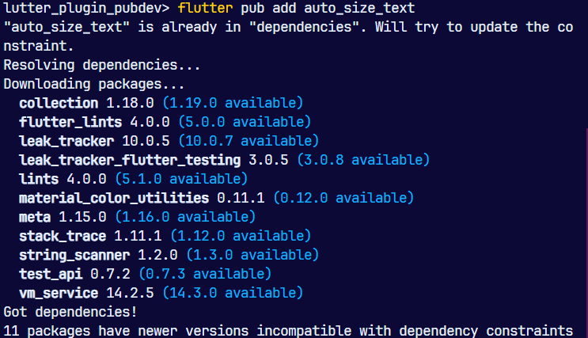
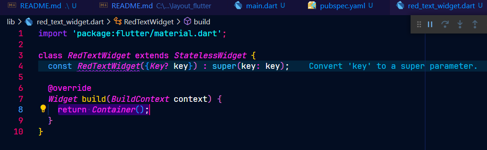
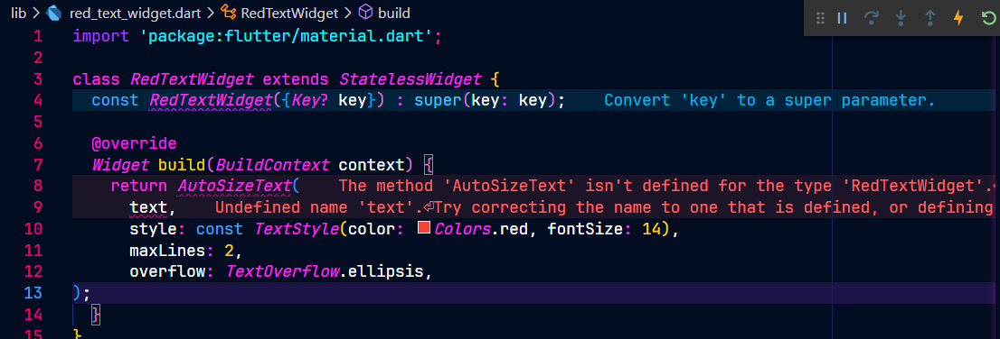
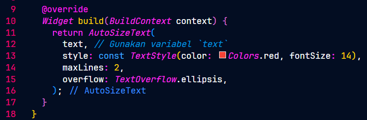
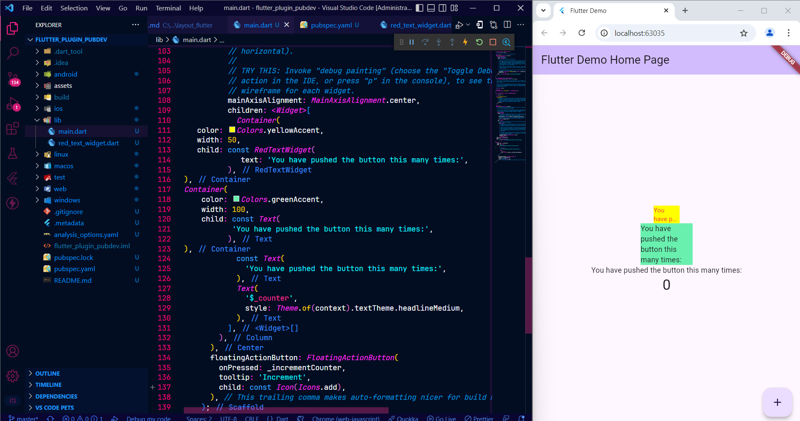
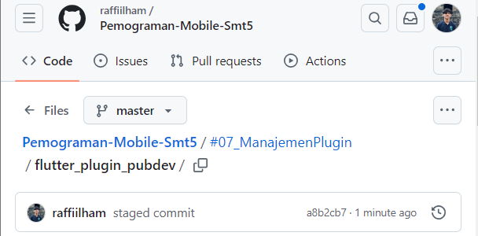

# **Pemrograman Mobile - Pertemuan 7**
### NO : 20
### NIM : 2241720226
### NAMA : Raffi Ilham Maulana

 

## **3. Praktikum Menerapkan Plugin di Project Flutter**

Selesaikan langkah-langkah praktikum berikut ini menggunakan editor Visual Studio Code (VS Code) atau Android Studio atau code editor lain kesukaan Anda.

Perhatian: Diasumsikan Anda telah berhasil melakukan setup environment Flutter SDK, VS Code, Flutter Plugin, dan Android SDK pada pertemuan pertama.

## **Langkah 1: Buat Project Baru**
Buatlah sebuah project flutter baru dengan nama flutter_plugin_pubdev. Lalu jadikan repository di GitHub Anda dengan nama flutter_plugin_pubdev.

## **Langkah 2: Menambahkan Plugin**
Tambahkan plugin auto_size_text menggunakan perintah berikut di terminal

flutter pub add auto_size_text
Jika berhasil, maka akan tampil nama plugin beserta versinya di file pubspec.yaml pada bagian dependencies.

## **Langkah 3: Buat file red_text_widget.dart**
Buat file baru bernama red_text_widget.dart di dalam folder lib lalu isi kode seperti berikut.

## **Langkah 4: Tambah Widget AutoSizeText**
Masih di file red_text_widget.dart, untuk menggunakan plugin auto_size_text, ubahlah kode return Container() menjadi seperti berikut.

Setelah Anda menambahkan kode di atas, Anda akan mendapatkan info error. Mengapa demikian? Jelaskan dalam laporan praktikum Anda!

### **Penjelasan**
Error terjadi karena:

text tidak didefinisikan. Ganti text dengan teks statis, misal 'Sample Text'.
AutoSizeText belum diimpor. Tambahkan import 'package:auto_size_text/auto_size_text.dart';.

## **Langkah 5: Buat Variabel text dan parameter di constructor**
Tambahkan variabel text dan parameter di constructor seperti berikut.

## **Langkah 6: Tambahkan widget di main.dart**
Buka file main.dart lalu tambahkan di dalam children: pada class _MyHomePageState
Run aplikasi tersebut dengan tekan F5, maka hasilnya akan seperti berikut.

## **8. Tugas Praktikum**
1. Selesaikan Praktikum tersebut, lalu dokumentasikan dan push ke repository Anda berupa screenshot hasil pekerjaan beserta penjelasannya di file README.md!
 

2. Jelaskan maksud dari langkah 2 pada praktikum tersebut!
 

3. Jelaskan maksud dari langkah 5 pada praktikum tersebut!
 

4. Pada langkah 6 terdapat dua widget yang ditambahkan, jelaskan fungsi dan perbedaannya!
 

5. Jelaskan maksud dari tiap parameter yang ada di dalam plugin auto_size_text berdasarkan tautan pada dokumentasi ini !
 

6. Kumpulkan laporan praktikum Anda berupa link repository GitHub kepada dosen!

