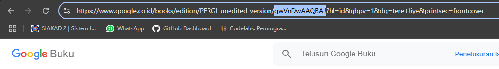
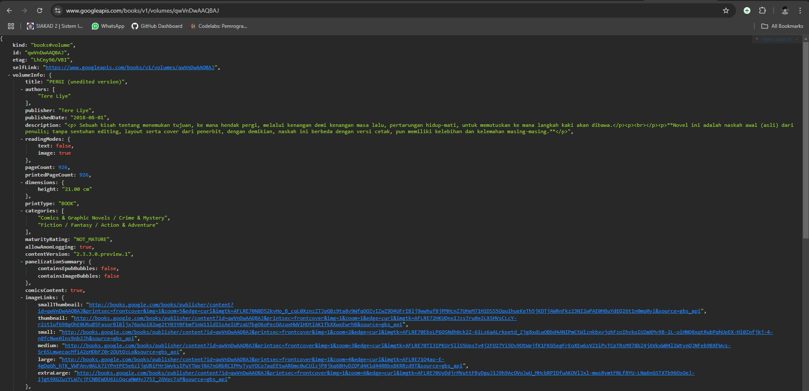
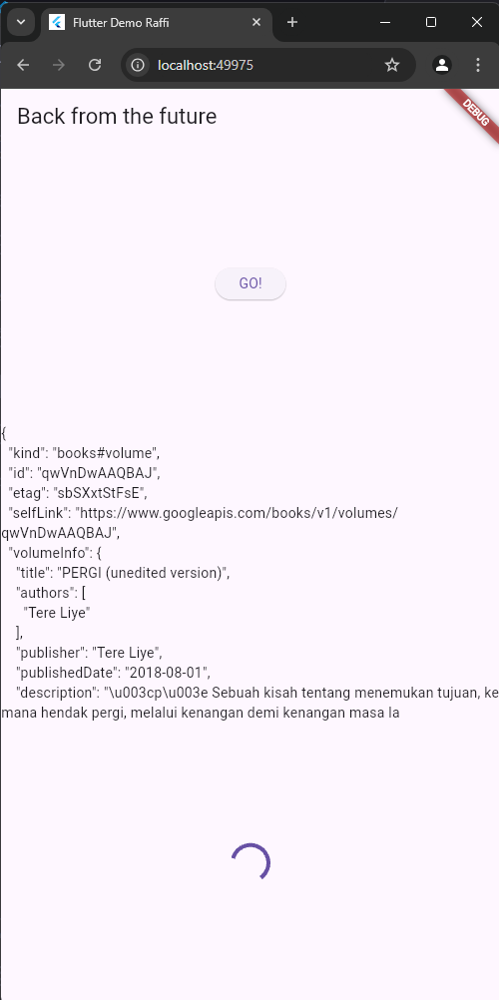
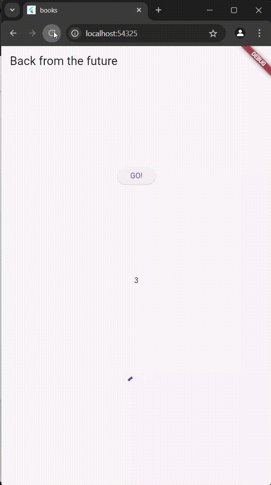
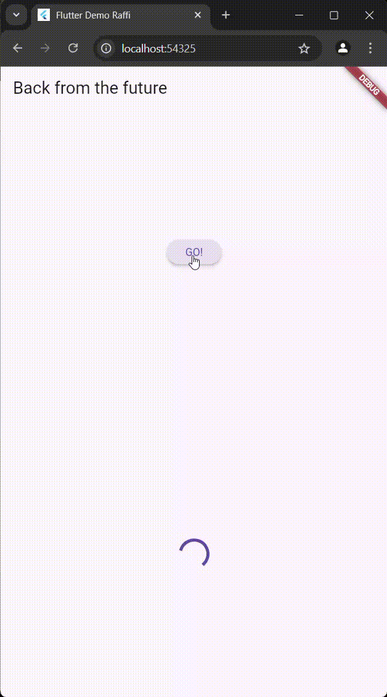
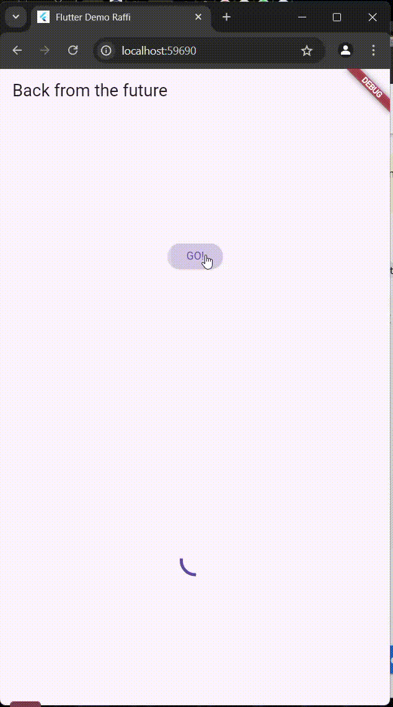

# **3. Praktikum 1: Mengunduh Data dari Web Service (API)**

### Soal 1 Tambahkan nama panggilan Anda pada title app sebagai identitas hasil pekerjaan Anda.

```
import 'dart:async';
import 'package:flutter/material.dart';
import 'package:http/http.dart';
import 'package:http/http.dart' as http;
void main() {
 runApp(const MyApp());
}

class MyApp extends StatelessWidget {
 const MyApp({Key? key}) : super(key: key);

 @override
 Widget build(BuildContext context) {
   return MaterialApp(
     title: 'Flutter Demo Raffi',
     theme: ThemeData(
       primarySwatch: Colors.blue,
       visualDensity: VisualDensity.adaptivePlatformDensity,
     ),
     home: const FuturePage(),
   );
 }
}

class FuturePage extends StatefulWidget {
 const FuturePage({Key? key}) : super(key: key);

 @override
 State<FuturePage> createState() => _FuturePageState();
}

class _FuturePageState extends State<FuturePage> {
 String result = '';

   Future<Response> getData() async {
      const authority = 'www.googleapis.com';
      const path = '/books/v1/volumes/qwVnDwAAQBAJ';
      Uri url = Uri.https(authority, path);
      return http.get(url);
  }

 @override
 Widget build(BuildContext context) {
   return Scaffold(
     appBar: AppBar(
       title: const Text('Back from the future'),
     ),
     body: Center(
       child: Column(children: [
         const Spacer(),
         ElevatedButton(
           child: const Text('GO!'),
           onPressed: () {},
         ),
         const Spacer(),
         Text(result),
         const Spacer(),
         const CircularProgressIndicator(),
         const Spacer(),
       ]),
     ),
   );
 }
}
```

### Soal 2 
- Carilah judul buku favorit Anda di Google Books, lalu ganti ID buku pada variabel path di kode tersebut. Caranya ambil di URL browser Anda seperti gambar berikut ini.

- Kemudian cobalah akses di browser URI tersebut dengan lengkap seperti ini. Jika menampilkan data JSON, maka Anda telah berhasil. Lakukan capture milik Anda dan tulis di README pada laporan praktikum. Lalu lakukan commit dengan pesan "W11: Soal 2".


### Soal 3
- Jelaskan maksud kode langkah 5 tersebut terkait substring dan catchError!
- Capture hasil praktikum Anda berupa GIF dan lampirkan di README. Lalu lakukan commit dengan pesan "**W11: Soal 3**".



# 4. Praktikum 2: Menggunakan await/async untuk menghindari callbacks

### **Soal 4**
- Jelaskan maksud kode langkah 1 dan 2 tersebut!<br>

**jawab :**

1. Penjelasan Kode Langkah 1 Langkah 1 mendefinisikan tiga fungsi Future, yaitu:

returnOneAsync()

Fungsi ini menjalankan Future.delayed selama 3 detik (mensimulasikan proses asinkron atau pemrosesan yang memakan waktu).
Setelah penundaan, fungsi mengembalikan nilai 1.
returnTwoAsync()

Sama seperti returnOneAsync(), tetapi mengembalikan nilai 2.
returnThreeAsync()

Sama seperti dua fungsi lainnya, tetapi mengembalikan nilai 3.
Ketiga fungsi ini digunakan untuk mensimulasikan proses asinkron yang dilakukan secara bertahap, seperti pengambilan data dari API atau proses komputasi yang membutuhkan waktu.

2. Penjelasan Kode Langkah 2 Fungsi count() bertujuan untuk:

Menggunakan fungsi asinkron dari Langkah 1.

Memanggil returnOneAsync() tiga kali secara berurutan. Karena fungsi ini menggunakan await, eksekusi selanjutnya menunggu setiap panggilan selesai.
Total dari nilai yang dikembalikan oleh ketiga fungsi tersebut dijumlahkan dan disimpan dalam variabel total.
Memperbarui nilai state dengan hasil akhir.

Hasil perhitungan (total) diubah menjadi String dan disimpan ke variabel result menggunakan setState.
setState digunakan untuk memperbaru

- Capture hasil praktikum Anda berupa GIF dan lampirkan di README. Lalu lakukan commit dengan pesan "W11: Soal 4".



# 5. Praktikum 3: Menggunakan Completer di Future

### **Soal 5**
- Jelaskan maksud kode langkah 2 tersebut!

**jawab :**<br>


### **Penjelasan Singkat**

1. **`late Completer completer;`**
   - Variabel `completer` adalah alat untuk mengontrol penyelesaian sebuah `Future`.

2. **`getNumber()`**
   - Membuat `Completer`, memulai proses asinkron di `calculate()`, dan mengembalikan `Future` yang akan diselesaikan.

3. **`calculate()`**
   - Mensimulasikan delay 5 detik menggunakan `Future.delayed`.
   - Setelah selesai, `completer.complete(42)` dipanggil untuk menyelesaikan `Future` dengan nilai **42**.

### **Alur**
**`getNumber()`** dipanggil → proses delay 5 detik di `calculate()` → `Future` diselesaikan dengan nilai **42**.

- Capture hasil praktikum Anda berupa GIF dan lampirkan di README. Lalu lakukan commit dengan pesan "**W11: Soal 5**".


### **Soal 6**
- Jelaskan maksud perbedaan kode langkah 2 dengan langkah 5-6 tersebut!

**jawab :**<br>

**Kesimpulan:**

1. **Langkah 2:**  
   - Hanya menangani kasus sukses tanpa mempertimbangkan error.

2. **Langkah 5:**  
   - Memanfaatkan hasil dari Langkah 2 dan menambahkan penanganan error dengan `catchError`.

3. **Langkah 6:**  
   - Memperluas Langkah 2 dengan menambahkan kemampuan untuk menangani error menggunakan `try-catch` dan menyelesaikan `Future` dalam kondisi gagal (`completeError`).

- Capture hasil praktikum Anda berupa GIF dan lampirkan di README. Lalu lakukan commit dengan pesan "**W11: Soal 6**".



# **6. Praktikum 4: Memanggil Future secara paralel**

### **Soal 7**
- Capture hasil praktikum Anda berupa GIF dan lampirkan di README. Lalu lakukan commit dengan pesan "**W11: Soal 7**".



### **Soal 8**
- Jelaskan maksud perbedaan kode langkah 1 dan 4!

**jawab :**

**Perbedaan Langkah 1 dan Langkah 4:**

**Langkah 1: Menggunakan `FutureGroup`**
- `FutureGroup` digunakan untuk mengelola beberapa `Future` dengan cara menambahkannya ke grup, menutup grup, dan menunggu semua `Future` selesai.
- Membutuhkan lebih banyak kode untuk menambahkan `Future` dan menutup grup (`close`).

**Langkah 4: Menggunakan `Future.wait`**
- `Future.wait` langsung menerima daftar `Future` dan mengembalikan `Future<List>`, menyelesaikan setelah semua `Future` selesai.
- Lebih sederhana, langsung menjalankan beberapa `Future` secara paralel tanpa perlu pengelolaan tambahan.

### **Kesimpulan:**
- **Langkah 4** lebih ringkas dan mudah dipahami, cocok untuk kebanyakan kasus.
- **Langkah 1** memberikan kontrol lebih, tetapi lebih kompleks dan membutuhkan lebih banyak kode.

# **7. Praktikum 5: Menangani Respon Error pada Async Code**

### **Soal 9**
- Capture hasil praktikum Anda berupa GIF dan lampirkan di README. Lalu lakukan commit dengan pesan "**W11: Soal 9**".


### **Soal 10**
- Panggil method handleError() tersebut di ElevatedButton, lalu run. Apa hasilnya? Jelaskan perbedaan kode langkah 1 dan 4!


**Penjelasan :**
- Hasil tidak berubah. Langkah 1 mendefinisikan fungsi returnError, yang membuat sebuah Future asinkron yang menunggu selama 2 detik sebelum melempar sebuah Exception. Fungsi ini tidak memiliki penanganan error di dalamnya, sehingga akan mengembalikan error langsung kepada pemanggilnya. Langkah 4 adalah implementasi penanganan error melalui fungsi handleError, yang memanggil returnError di dalam blok try-catch. Jika terjadi error, kode di dalam blok catch akan dijalankan untuk menangkap dan menangani error, misalnya dengan mengubah UI menggunakan setState. Selain itu, blok finally memastikan bahwa pesan "Complete" akan dicetak ke konsol, terlepas dari apakah error terjadi atau tidak.
