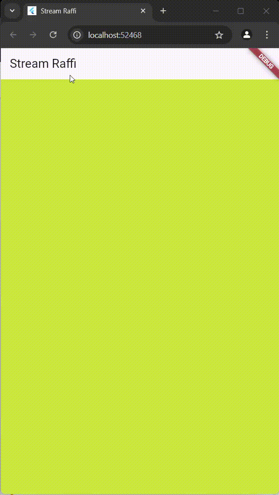

#### Nama : Raffi Ilham Maulana
#### Kelas: TI-3F / 20
#### NIM  : 2241720226

---

# Laporan Jobsheet 12 Pemrograman Mobile

## Praktikum 1
### Soal 1
```dart
  Widget build(BuildContext context) {
    return MaterialApp(
      title: 'Stream Raffi',
      theme: ThemeData(
        primarySwatch: Colors.deepPurple,
      ),
      home: StreamHomePage(),
    );
  }
```

## Praktikum 1
### Soal 1
```class ColorStream {
  final List<Color> colors = [
    Colors.blueGrey,
    Colors.amber,
    Colors.deepPurple,
    Colors.lightBlue,
    Colors.teal,
    Colors.brown,
    Colors.pink,
    Colors.indigo,
    Colors.lime,
    Colors.black,
  ];
}
```

## Praktikum 1
### Soal 3
```dart	
yield* Stream.periodic(
  const Duration(seconds: 1), (int t) {
    int index = t % colors.length;
    return colors[index];
});
```	
- yield* dalam Dart digunakan untuk menghasilkan nilai dari iterable atau stream lain secara langsung dalam sebuah fungsi generator. Dalam konteks Stream atau fungsi asynchronous, yield* memungkinkan Anda untuk meneruskan semua elemen dari stream atau iterable yang di-referensikan tanpa harus mengiterasinya secara manual menggunakan loop. Pada contoh di atas, yield* digunakan untuk mengalirkan setiap elemen dari Stream.periodic, yang menghasilkan nilai berdasarkan perhitungan dalam fungsi callback (mengembalikan elemen dari daftar colors secara bergantian berdasarkan indeks yang dihitung).

### Soal 4

