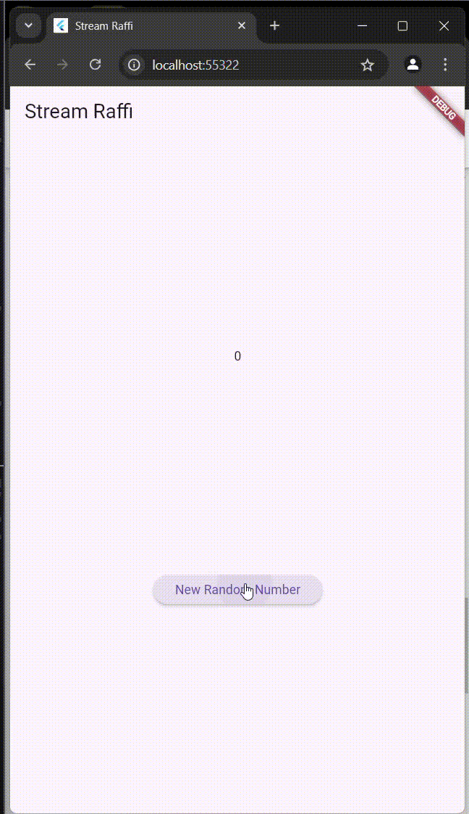

#### Nama : Raffi Ilham Maulana
#### Kelas: TI-3F / 20
#### NIM  : 2241720226

---

# Laporan Jobsheet 12 Pemrograman Mobile

## Praktikum 1: Dart Streams
### Soal 1
```dart
  Widget build(BuildContext context) {
    return MaterialApp(
      title: 'Stream Raffi',
      theme: ThemeData(
        primarySwatch: Colors.deepPurple,
      ),
      home: StreamHomePage(),
    );
  }
```

## Praktikum 1
### Soal 1
```class ColorStream {
  final List<Color> colors = [
    Colors.blueGrey,
    Colors.amber,
    Colors.deepPurple,
    Colors.lightBlue,
    Colors.teal,
    Colors.brown,
    Colors.pink,
    Colors.indigo,
    Colors.lime,
    Colors.black,
  ];
}
```

## Praktikum 1
### Soal 3
```dart	
yield* Stream.periodic(
  const Duration(seconds: 1), (int t) {
    int index = t % colors.length;
    return colors[index];
});
```	
- yield* dalam Dart digunakan untuk menghasilkan nilai dari iterable atau stream lain secara langsung dalam sebuah fungsi generator. Dalam konteks Stream atau fungsi asynchronous, yield* memungkinkan Anda untuk meneruskan semua elemen dari stream atau iterable yang di-referensikan tanpa harus mengiterasinya secara manual menggunakan loop. Pada contoh di atas, yield* digunakan untuk mengalirkan setiap elemen dari Stream.periodic, yang menghasilkan nilai berdasarkan perhitungan dalam fungsi callback (mengembalikan elemen dari daftar colors secara bergantian berdasarkan indeks yang dihitung).

### Soal 4


### Soal 5

```dart	
    colorStream.getColors().listen((eventColor){
      setState(() {
        bgColor = eventColor;
      });
    });
```
- Perbedaan utama antara menggunakan `listen` dan `await for` dalam Dart terletak pada cara mereka menangani aliran data dari sebuah *stream*. Metode `listen` digunakan untuk berlangganan ke *stream* dan memproses setiap *event* secara langsung menggunakan *callback*. Ini ideal untuk situasi yang memerlukan respons cepat tanpa menunggu *stream* selesai. Di sisi lain, `await for` digunakan dalam fungsi asinkron untuk memproses setiap elemen *stream* secara berurutan hingga selesai, memberikan penanganan yang lebih terstruktur. Dengan `listen`, Anda memiliki fleksibilitas untuk mengelola *subscription* secara manual, seperti melakukan *pause* atau *resume*. Sementara itu, `await for` lebih sederhana tetapi hanya dapat digunakan dalam konteks fungsi asinkron.

## 4. Praktikum 2: Stream controllers dan sinks

### Soal 6

1. Langkah 8:
- Menginisialisasi objek NumberStream dan StreamController.
- Membuat objek Stream dari StreamController.
- Menambahkan listener ke stream tersebut. Setiap kali ada data yang masuk ke dalam stream, fungsi yang diberikan kepada listen akan dipanggil. Dalam kasus ini, fungsi tersebut akan memperbarui lastNumber menggunakan setState. Ini umumnya dilakukan untuk memastikan bahwa perubahan nilai di dalam widget diperbarui dan direfleksikan pada antarmuka pengguna (UI).

2. Langkah 10:
- Membuat fungsi addRandomNumber yang bertujuan untuk menambahkan angka acak ke dalam stream menggunakan objek NumberStream.
- Fungsi ini menggunakan objek Random untuk menghasilkan angka acak antara 0 dan 9, dan kemudian memanggil metode addNumberToSink pada objek NumberStream untuk menambahkan angka tersebut ke dalam stream.
